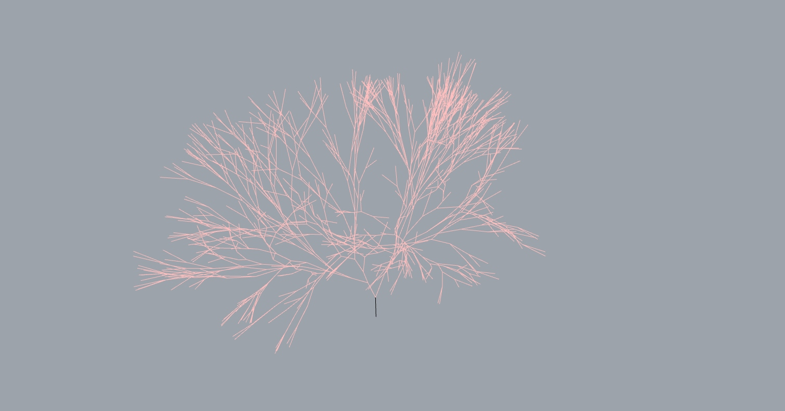
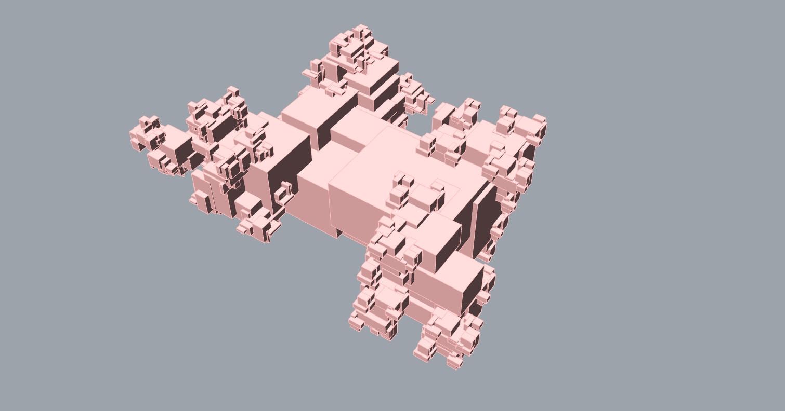

## 1 - Vector Calculations

### 1a 
Given two vectors, use the cross product to create a set of three orthonormal vectors.

### 1b 
Use the cross product to compute the area of a convex, 2D polygon.

### 1c 
Define a function for computing the cross products of two same-length arrays of vectors by
    a. Prototype in pure Python (loop over the arrays).
    b. Make Numpy equivalent without loops.

## 2 - Recursive Functions

### 2a Recursive Branching Lines
Write a recursive function in Grasshopper Python, which creates a random 2D or 3D branching structure. Fill in the missing code in the Python component in the ghx file [assignment_2a_recursion_branches_lines.ghx](assignment_2a_recursion_branches_lines.ghx).

The output of the 2D branching should look similar to this:

and the output of the 3D branching should look similar to this:

### 2b Recursive Branching Boxes
Write a recursive function for in Grasshopper Python, which creates a random 3D branching structure with boxes around the branches. Fill in the missing code in the Python component in the ghx file [assignment_2b_recursion_branches_boxes.ghx](assignment_2b_recursion_branches_boxes.ghx).

The output of the 3D recursive boxes should look similar to this:

