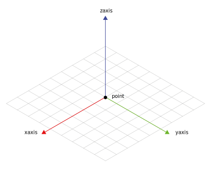
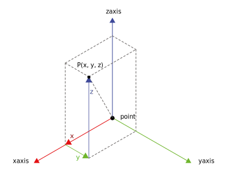
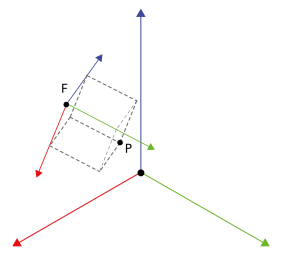
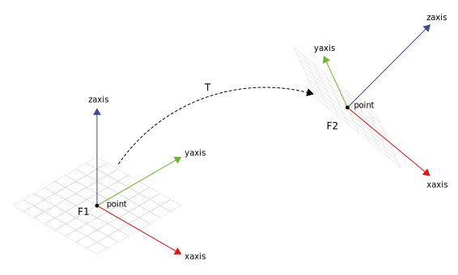
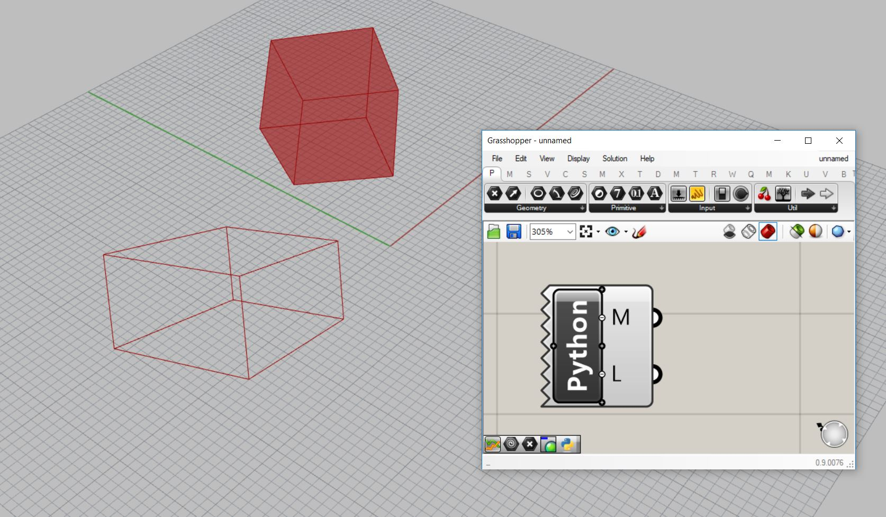
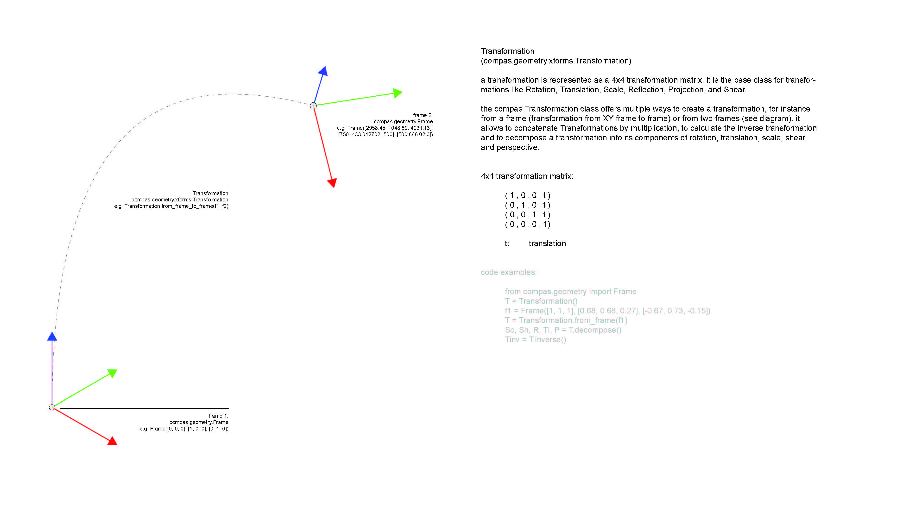

[<< Back to index](index.md)

# 1. Frame and Transformation

## Frame

A frame is defined by a base point and two orthonormal base vectors (xaxis, yaxis), which specify the normal (zaxis). It describes location and orientation in a cartesian coordinate system.



There are several ways to construct a ```Frame```:

```python
from compas.geometry import Point
from compas.geometry import Vector
from compas.geometry import Frame

F = Frame(Point(1, 0, 0), Vector(-0.45, 0.1, 0.3), Vector(1, 0, 0))
F = Frame([1, 0, 0], [-0.45, 0.1, 0.3], [1, 0, 0])
F = Frame.from_points([1, 1, 1], [2, 3, 6], [6, 3, 0])
F = Frame.from_euler_angles([0.5, 1., 0.2])
F = Frame.worldXY()
```

It can also be used as a cartesian coordinate system by itself.



Here is a simple example of how to use a frame as a coordinate system: Starting from a point `P` in the local (user-defined, relative) coordinate system of frame `F`, i.e. its position is relative to the origin and orientation of `F`, we want to get the position `P_` of `P` in the global (world, absolute) coordinate system.

```python
from compas.geometry import Point
from compas.geometry import Vector
from compas.geometry import Frame

point = Point(146.00, 150.00, 161.50)
xaxis = Vector(0.9767, 0.0010, -0.214)
yaxis = Vector(0.1002, 0.8818, 0.4609)

# coordinate system F
F = Frame(point, xaxis, yaxis)

# point in F (local coordinates)
P = Point(35., 35., 35.)
# point in global (world) coordinates
P_ = F.represent_point_in_global_coordinates(P)
```





### Examples

Bring a Mesh from one coordinate system into another coordinate system


### Further information

* https://en.wikipedia.org/wiki/Frame_of_reference
* https://en.wikipedia.org/wiki/Cartesian_coordinate_system


--------------------------------------------------------------------------------


## Transformation

The Transformation represents a 4x4 transformation matrix.

It is the base class for transformations like Rotation, Translation, Scale, Reflection, Projection and Shear.

There are several ways to construct a Transformation. The following example computes a change of basis transformation from world XY to frame F.

```python
from compas.geometry import Frame
from compas.geometry import Transformation
F = Frame([1, 1, 1], [0.68, 0.68, 0.27], [-0.67, 0.73, -0.15])
T = Transformation.from_frame(f1)
```

This example computes a change of basis transformation between two frames.
This transformation maps geometry from one Cartesian coordinate system defined by "F1" to another Cartesian coordinate system defined by "F2".

```python
from compas.geometry import Frame
from compas.geometry import Transformation
F1 = Frame([2, 2, 2], [0.12, 0.58, 0.81], [-0.80, 0.53, -0.26])
F2 = Frame([1, 1, 1], [0.68, 0.68, 0.27], [-0.67, 0.73, -0.15])
T = Transformation.from_frame_to_frame(F1, F2)
```


= Affine transformations (Translation, Rotation, Shear, Scale, Mirror, Projection)

```python
from compas.geometry import Frame
from compas.geometry import Box
from compas_ghpython import draw_box # TODO: implement this

box = Box(Frame.worldXY(), 10, 10, 10)
frame = Frame([1, 0, 0], [-0.45, 0.1, 0.3], [1, 0, 0])
T = Transformation.from_frame(frame)
box_transformed = box.transformed(T)

draw_box(box)
draw_box(box_transformed)
```



4x4 matrix, 3x3 rotation : Difference Vector and Point (homogenisation with 0 or 1)

It matters which transformation first: not commutative (AxB != BxA)

Difference between transform(), transformed()

## Rotation

Orientation: Euler angles, axis angle representation, Quaternion

### Examples

#### Example 1: Rotations from euler angles
Rotate an object based on 3 euler angles

```python
import compas
from compas.geometry import Frame
from compas.geometry import Rotation
from compas.datastructures import Mesh
from compas.datastructures import mesh_transform

# euler angles
alpha, beta, gamma = -0.156, -0.274, 0.785

# Version 1: Create Rotation from angles and apply rotation to mesh

R = Rotation.from_euler_angles([alpha, beta, gamma], static=True, axes='xyz')
mesh = Mesh.from_obj(compas.get('saddle.obj')) # sample mesh
mesh_transform(mesh, R)

# Version 2: Create 3 Rotations from angles and apply each rotation to mesh

xaxis, yaxis, zaxis = [1, 0, 0], [0, 1, 0], [0, 0, 1]
Rx = Rotation.from_axis_and_angle(xaxis, alpha)
Ry = Rotation.from_axis_and_angle(yaxis, beta)
Rz = Rotation.from_axis_and_angle(zaxis, gamma)

mesh = Mesh.from_obj(compas.get('saddle.obj')) # sample mesh
mesh_transform(mesh, Rx)
mesh_transform(mesh, Ry)
mesh_transform(mesh, Rz)

# Version 3: Concatenate 3 Rotations and apply rotation once

R = Rz * Ry * Rx # check order ! if static=False, this is reversed!
mesh = Mesh.from_obj(compas.get('saddle.obj')) # sample mesh
mesh_transform(mesh, R)
```

#### Example 2: Project a cube

The following example shows how to project the points of a box onto the xy-plane.

```python
from compas.geometry import Frame
from compas.geometry import Projection
from compas.geometry import transform_points
from compas.geometry import Box

from compas.datastructures import Mesh
from compas_ghpython import mesh_draw
from compas_ghpython import mesh_draw_edges

# create a box
frame = Frame([0, 0, 20], [-0.47, 0.85, -0.24], [-0.75, -0.53, -0.39])
box = Box(frame, 10, 10, 10)

# try different projections
point, normal = [0, 0, 0], [0, 0, 1] # projection plane is xy plane
# project orthogonal onto the plane
P = Projection.orthogonal(point, normal)
# project parallel with a certain direction
P = Projection.parallel(point, normal, [-0.5, 0.1, -0.7])
# project perspective from a certain view point
P = Projection.perspective(point, normal, [6, -10, 60])

# Perform the transformation onto the box' vertices 
pts = transform_points(box.vertices, P)

# draw the box
mesh = Mesh.from_vertices_and_faces(box.vertices, box.faces)
M = mesh_draw(mesh)

# draw edges between the transformed points
mesh = Mesh.from_vertices_and_faces(pts, box.faces)
L = mesh_draw_edges(mesh)
```

If you paste the above code in a GhPython component with 2 outlets named `L`and 
`M`, the result would look like this: 



### Images




### Further information

* https://en.wikipedia.org/wiki/Transformation_matrix
* https://en.wikipedia.org/wiki/Euler_angles
* https://en.wikipedia.org/wiki/Axis%E2%80%93angle_representation
* https://en.wikipedia.org/wiki/Quaternion


[<< Back to index](index.md)
